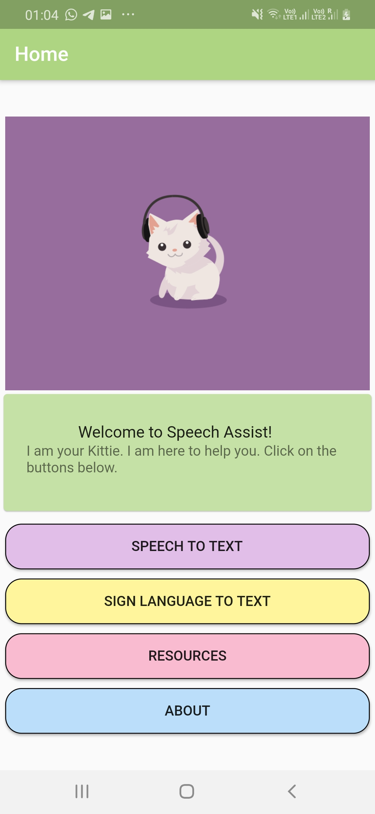
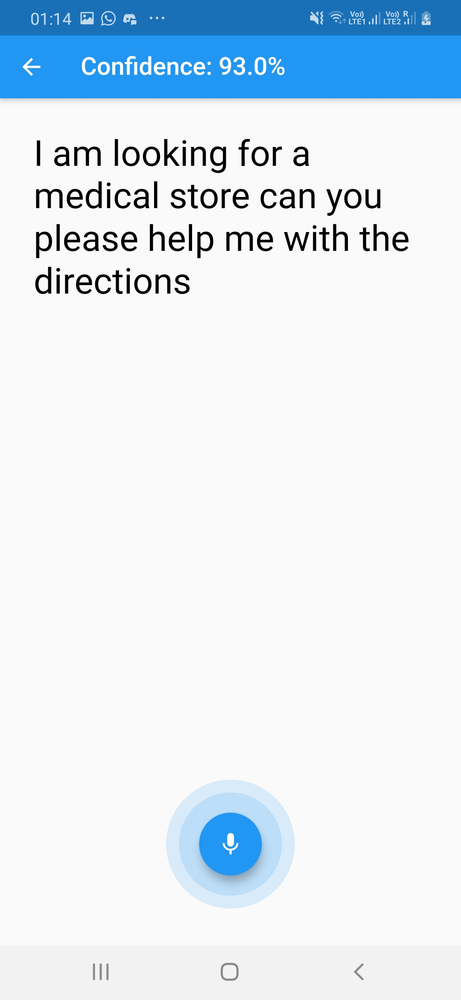
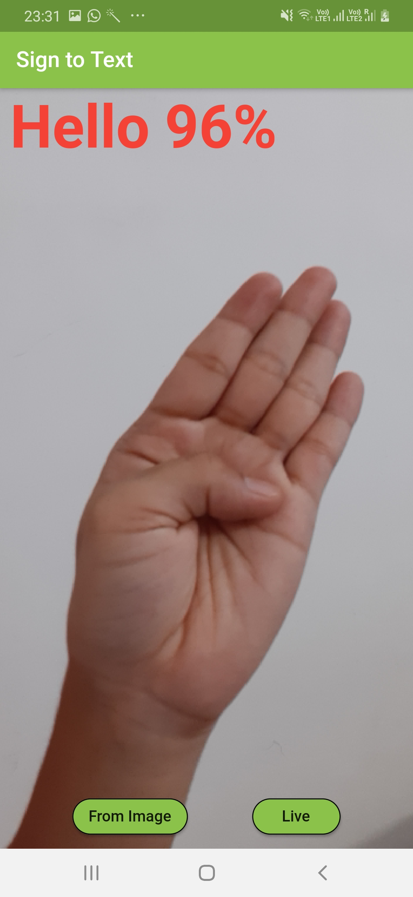
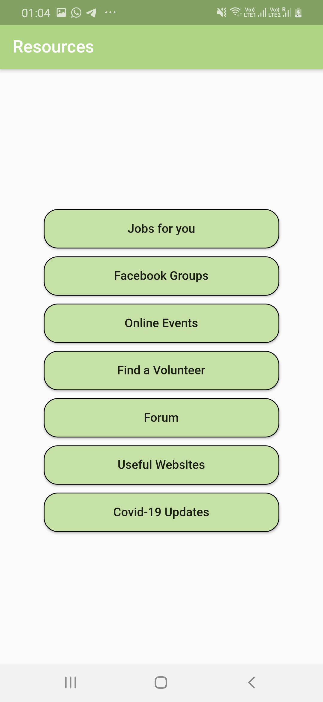
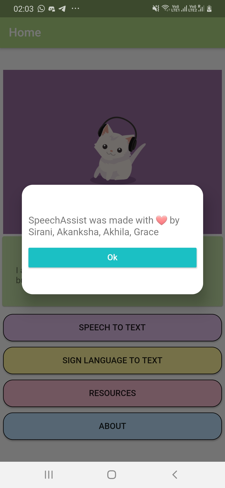

# Speech Assist
Speech Assist transcribes speech to text, text to speech & video to sign language. We provide resources & promote community. 

## What it does?
Our app **Speech Assist** helps people by transcribing speech into text on their screen in real-time.   
With masks being mandatory in many countries, its difficult for people with hearing impairments to interpret others. Our app provides real-time speech transcription in speech to text, text to speech, and video to sign language format. We also provide a resource, community and help page. 
Link to the [slides](https://docs.google.com/presentation/d/1_X4qk2I0Xt7WcJKYtqguyhzsBhgRutPlBobMWyB896U/edit?usp=sharing)  
    
